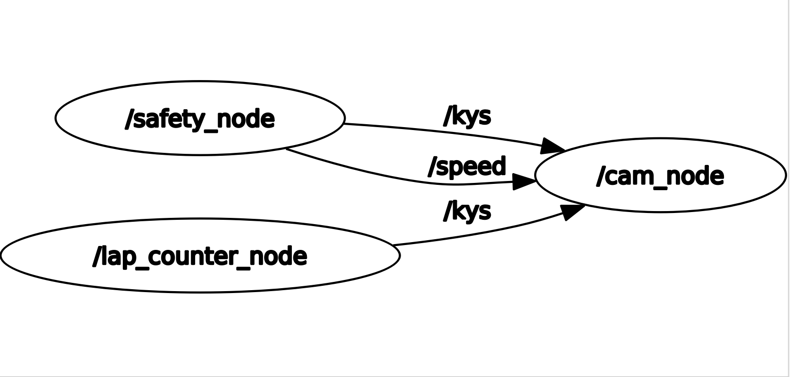

# Milestone 3 - On-Car Safe Reactive Driving using Computer Vision

## Overview
This milestone 3 package builds on the previous milestones, implementing gap-following and AEB with Computer Vision. This milestone package also implements lap counting with a tunable parameter to control how many laps the car can do.

The milestone1_py launch file runs the old AEB and wall-following nodes:
`ros2 launch milestone2 milestone1_py.py`

The milestone2_py launch file runs the old AEB and gap-following nodes:
`ros2 launch milestone2 milestone2_py.py`

The milestone3_py launch file runs the new AEB, gap-following, and lap counting nodes:
`ros2 launch milestone3 milestone3_py.py`

## Milestone 3 Nodes

### 1) safety_node (AEB)
**Inputs**
- `/camera/depth/image_rect_raw` (Image)
- `/odom` (Odometry)

**Output**
- `/drive` (AckermannDriveStamped)
- `/kys` (Bool)

**Core Idea**
- By splitting the camera feed into vertical chunks, we can calculate time-to-collision (TTC) by treating these chunks like an array, and calculating the estimated distance from the car to each chunk. With the calculated TTC, progressive braking is applied to slow the car down at specific TTC thresholds, stopping the car completely if the TTC is low enough, or if the distance to the nearest object is too low. There are 3 stages total to progressive braking, two of which slow the car and the final stage is a full stop. 

**Key Changes Compared to LiDAR Algorithm**
1) Instead of using a LiDAR scanner, the depth camera feed is divided into vertical chunks (16 virtual beams) to simulate multi-directional range measurements.
2) TTC is computed and progressive braking thresholds are applied (PB1, PB2, FB) based on TTC values (Old TTC progressive braking was buggy).
3) An absolute distance threshold provides emergency stopping for cases where velocity is very low or zero (This was in the old AEB, but stopping distance has to be adjusted due to new technology).
4) RGB-D depth frames are processed every camera frame cycle rather than LiDAR scan cycles. 

### 2) cam_node (Gap Following)
**Input**
- `/camera/color/image_raw` (Image)
- `/kys` (Bool)
- `/speed` (AckermannDriveStamped)

**Output**
- `/drive` (AckermannDriveStamped)

**Core Idea**
- This node takes raw RGB images from the camera and applies morphological filters (erosion/dilation) followed by thresholding to detect the white driving path. It extracts the target position from the filtered path and uses a PID controller to compute steering angles that keep the car centered on the path.

**Key Changes Compared to LiDAR Algorithm**
1) Uses camera image filtering instead of LiDAR scan matching to identify the driving corridor.
2) Applies erosion and dilation to clean noise and connect path segments before binary thresholding.
3) Calculates the center of mass of the detected path at a target row (y=400) to determine steering error.
4) Uses proportional, integral, and derivative gains to smoothly converge steering angle toward zero error.

### 3) lap_counting (Lap Counting)
**Input**
- `/camera/color/image_raw` (Image)

**Output**
- `/kys` (Bool)

**Core Idea**
- This node counts the number of laps the car has driven. It has a reference picture indicating the start of a lap, which the node compares to constantly as the car drives. When the node detects a certain cosine similarity to the starting point, the car will recognize a lap as complete. 

**Algorithm**
1) Capture the first frame as the reference image and compute its feature descriptors.
2) For each incoming frame, compute its feature descriptors.
3) Use a brute-force distance matcher to find matching features between reference and current descriptors.
4) Calculate similarity as: 1 - the normalized distance of the best 50 matches (1 = most similar, 0 = dissimilar).
5) Track the car as near the beginning when similarity >= 0.9, and not near the start when similarity < 0.7.
6) Transitioning between states increments the lap counter
7) When lap count reaches the configured limit, publish the kill-switch signal.

## Parameters
### safety_node
- `ttc_pb1` (seconds): threshold for first stage of progressive braking
- `ttc_pb2` (seconds): threshold for second stage of progressive braking
- `ttc_fb` (seconds): threshold for full brake
- `pb1_speed_mult` (float): multiplier to apply current speed when first stage of progressive braking is triggered
- `pb2_speed_mult` (float): multiplier to apply current speed when second stage of progressive braking is triggered
- `distance_threshold` (meters): absolute distance threshold for emergency braking (regardless of TTC)
- `timer_period_threshold` (seconds): minimum time between lap count increments to prevent false positives

### cam_node
- `K_p, K_i, K_d` (floats): PID controller gains (ROS parameters; tunable via config or `ros2 param set`)

### lap_counter
- `lap_count` (int): number of laps to complete before triggering kill switch 

## General Testing Strategies
- Camera-based AEB:
  - Test with static obstacle at varying distances and verify TTC calculation accuracy (approximation)
  - Test progressive braking stages by observing velocity when approaching an object
  - Verify full brake triggers both on TTC and distance threshold violations
  
- Camera-based Gap following:
  - Test on tracks and verify that it is running laps smoothly
  - Observe steering angle response is approximately proportional to PID gains
  - Verify the path detection filters remove noise without losing path information
  
- Lap Counting:
  - Capture reference image with clear, distinct features
  - Test similarity with many different pictures to get a grasp of parameters
  - Verify debounce timer prevents false lap increments
  - Test behavior when car approaches start line multiple times
  
- Parameter sweep:
  - Vary TTC thresholds to find optimal braking responsiveness
  - Keep same PID parameters from previous milestones.
  - Test erosion/dilation kernel sizes 
  
- Edge cases:
  - No valid path detected (lost in open space)
  - Sudden obstacles at very close range
  - Poor lighting affecting image-based detection
  - High velocity requiring aggressive braking

## Parameter Tuning/Derivation Strategies:
- Camera-based AEB:
  - Start with high TTC thresholds and lower them incrementally until consistent braking response is achieved
  - Tune speed multipliers based on wheel slip and stopping distance observations
  - Set distance_threshold based on minimum safe stopping distance at maximum speed tested
  - Validate TTC calculations by ensuring estimated distance and velocity produce reasonable TTC values
  
- Camera-based Gap following:
  - PID variables remain the same from previous milestones
  - Adjust image filtering parameters (kernel size, threshold value) based on path appearance in test environment
  - Choose target row based on camera field of view
  
- Lap Counting:
  - Adjust similarity thresholds  based on feature consistency at different positions on track during testing
  - Increase lap_time debounce if false positives occur; decrease if detection is delayed
  - Select reference image with defining features
  - Test with varying number of matches if similarity scores are unstable

## RQT Graph


## How to Run

### Run the milestone 1 nodes (Old AEB + Wall following)
```bash
colcon build
source install/local_setup.bash
ros2 launch milestone2 milestone1_py.py
```

### Run the milestone 2 nodes (Old AEB + Gap following)
```bash
colcon build
source install/local_setup.bash
ros2 launch milestone2 milestone2_py.py
```

### Run the milestone 3 nodes (New AEB + Gap following + Lap Counting)
```bash
colcon build
source install/local_setup.bash
ros2 launch milestone2 milestone3_py.py
```

### Change parameters
```bash
# AEB node (edit config/safety_params.yaml and update thresholds)
ros2 param set /safety_node ttc_pb1 <value>
ros2 param set /safety_node distance_threshold <value>

# Gap following node (edit config/gap_follow_params.yaml for PID gains)
ros2 param set /cam_node K_p <value>
ros2 param set /cam_node K_d <value>
```
---